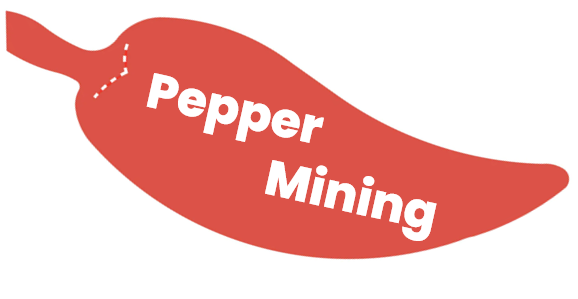
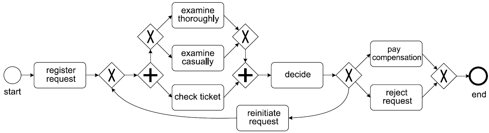
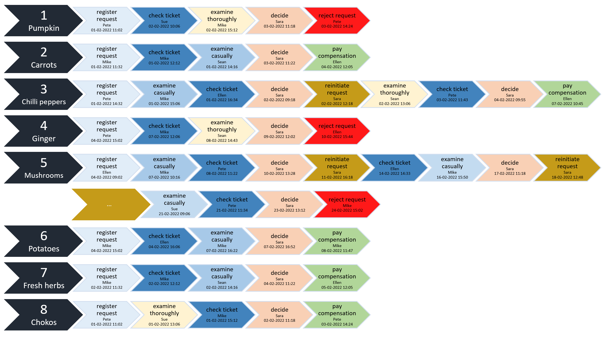
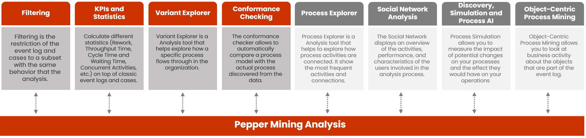

<div align="center">



## **An open-source Process Mining library in Python**
## 🌶🌶🌶 **Pepper Mining - Alpha version. 🌶🌶🌶**
## `pip install peppermining` </br>
</br>

<div align="left">

  # Welcome to Pepper Mining

<br>Pepper Mining is a open source Process Mining platform written in Python, designed to be used in both academia and industry.
<br>Pepper Mining is a framework designed firstly be the backend of an application. Such, the effort in this project is to build a framework following Design Patterns.
<br>In this documentation, you can find all relevant information to set up Pepper Mining and start your Process Mining journey.

## <span>&#9888;</span> Are you discovering Process Mining?
<br>I recommend accessing the contents of <a href="https://www.processmining.org/">processmining.org</a> and follow <b>Prof.dr.ir. Wil van der Aalst </b> on social media.
<br>The Process Mining Handbook is amazing, you can reading in https://link.springer.com/book/10.1007/978-3-031-08848-3.
<br>See also <a href="https://pm4py.fit.fraunhofer.de/">PM4PY</a>, it is another open source Process Mining platform.


Enjoy #processmining!

## 🚀 Installation

The Pepper Mining installation is very easy and used only 4 Python libraries.
For more details about the Pepper Mining requirements, see too the [setup.py](https://github.com/ThoberDetofeno/peppermining/blob/main/setup.py)
Install via PyPi
You can install Pepper Mining with Python's pip package manager:

```python
# install peppermining
pip install peppermining
```

## 🏃‍♂️ Quickstart
In this tutorial you will have a journey about the main features available in Pepper Mining.

Therefore, for a more detailed overview of process mining, we recommend looking at the [Coursera MOOC](https://www.coursera.org/learn/process-mining) on [Process Mining and the seminal book of Wil van der Aalst](https://link.springer.com/book/10.1007/978-3-662-49851-4). Furthermore, before you begin, please install Pepper Mining on your system, i.e., as described in the Installation section.

### Data preparation
In the remainder of this tutorial, we will use an oftenly used dummy example event log to explain the basic process mining operations. The process that we are considering is a simplified process related to customer complaint handling, i.e., taken from the book of van der Aalst. 

The process, and the event data we are going to use, looks as follows.
  
 

  
We have prepared a small sample event log, containing behavior similar equal to the process model. The samples we are using in this example contain 8 Cases and 52 Event log.

Observe that, the arrow black in the picture below describe the Case and the arrow colorful are Event log. The Case contain two information, first a number that represent the case_id and second is a attribute with Product name. Each Event log contain the case_id, activity name, timestamp that start the activity, and resource that executed the activity.
  
 

  
One of the characteristics of Pepper Mining is that the Event log is mandatory, but is possible to add the Cases information in separated. In this way, is possibible to add informations that represent all event logs and can be using with more performance in the filter operations or compliance analysis.
The data this tutorial is available in CSV format, on the links below:
  
Cases: https://raw.githubusercontent.com/ThoberDetofeno/peppermining/main/tests/data/case-example.csv

Event log: https://raw.githubusercontent.com/ThoberDetofeno/peppermining/main/tests/data/eventlog-example.csv

### Creating a Pepper Mining analysis
Pepper Mining analysis is the beginning of all things. When creating the PepperMining object we are creating a Pepper Mining analysis.
The first step is creating a PepperMining object, the next step is to add data from Event Logs and Cases.

After these two first steps are possible to visualize, filter and to do all operations in Pepper Mining.
```python
import peppermining as pm
# First step: Create Pepper analysis
pepper = pm.PepperMining()
# Second step: Add Event log and Case data
pepper.read_event_log_csv('https://raw.githubusercontent.com/ThoberDetofeno/peppermining/main/tests/data/eventlog-example.csv')
pepper.read_cases_csv('https://raw.githubusercontent.com/ThoberDetofeno/peppermining/main/tests/data/case-example.csv')
```
### Basic data visualizations  
In this section the basic visualizations of the data added in Pepper Mining.

The basic views are: Event log, Cases and Activities  
```python
# Return Event logs data
pepper.get_event_log()
# Return Cases data
pepper.get_cases()
# Return Activities data
pepper.get_activities()
```
### Filtering
Filtering is the restriction of the Pepper Mining analysis (Event log and Case) to a subset of the behavior.

After filtering the return object it have all behavior that Pepper Mining analysis. Because, de Pepper Filter is a inheritance of Pepper Mining.

It is possible to do a hierarchy of filters, because each filter is a object.
This way the user can make "n" filters and return to last step without losing the performance of the software.

  
The first filter is select all Event Logs that ended with activity 'pay compensation'. For this, let's create the CaseEndActivityFilter object.
```python
# Filter on end activities of Pepper Mining analysis
filter_1 = pm.filters.CaseEndActivityFilter(pepper, ['pay compensation'])
filter_1.get_cases()
```

For the second filter, let's use the previous filter result. Now we want to view all events except the 7 and 8 cases. For this,  let's create the CaseFilter object with the parameter 'not contain'.
  
```python
# Case Filter of Pepper Filter (CaseEndActivityFilter)
filter_2 = pm.filters.CaseFilter(filter_1, [7, 8], 'not contain')
filter_2.get_cases()
```
To finish this section, we show the filters used in second filter.
```python
# Visualize the filter used in second filter
filter_2.get_filter()
```
### Variant Explorer
<br>Come soon

### KPIs and Statistics
<br>Come soon

### Conformance Checking
<br>Come soon

  
## <span>&#10070;</span> API Modules


<br>Come soon
  
## 📝 License
Pepper Mining is completely free and open-source and licensed under the [MIT](https://github.com/ThoberDetofeno/peppermining/blob/main/LICENSE.txt) license.
